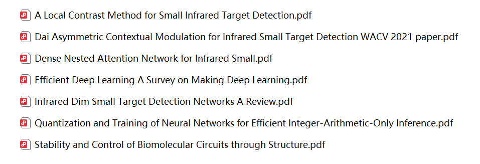
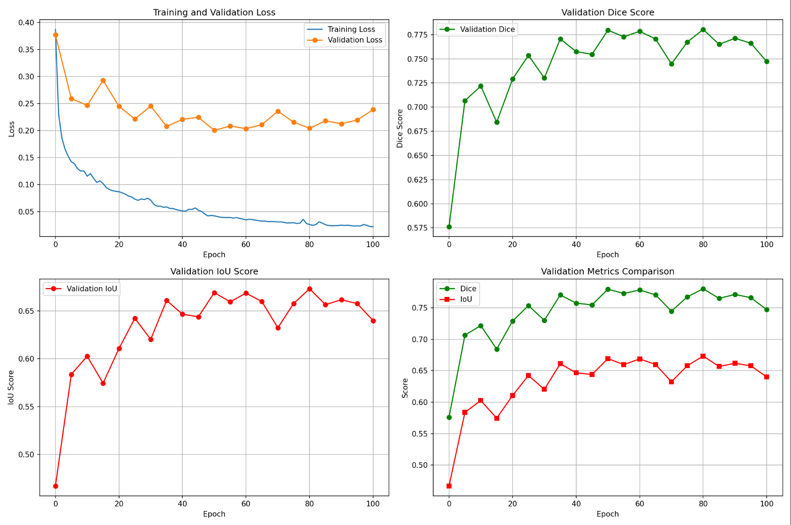

# Graduation-Project-preview
Reading and Practice Week Work Log（2026.1.12-2026.1.16）
## 一、任务概述
### 1、毕设选题简介：
自Meta公司开源SAM（Segment Anything Model）模型后，作为一个通用的图像分割工具，能够适用于各种下游图像分割任务。但是其巨量的参数和训练难度使得普通项目难以采用。MobileSAM模型是在2023年6月27日发布的，其对之前的SAM分割一切大模型进行了轻量化的优化处理，模型整体体积缩小了60倍，运行速度提高40倍，但分割效果却依旧很好。使得普通的开发者能够自己基于SAM开发更轻量的图像分割项目。
#### 现有问题：但是在红外小目标检测中，因为自然图像与红外图像之间的显著的领域差异，使得直接使用预训练的SAM效果一直都不是十分令人满意。与可见光相机不同，热成像仪通过捕获红外辐射来揭示物体的温度分布。小目标通常会在物体边界处表现出微妙的温度转变，使得目标物体边缘非常的模糊。其次，红外小目标图像的特点是远处尺寸小，背景噪点大，信噪比低。因此直接采用SAM的效果并不是很好。
#### 为了解决以上问题，我期望通过迁移学习MobileSam这一个轻量化的模型为基准模型并通过引入一些模块，改变其原始架构以更好的学习到红外小目标的特征表示，使得SAM能够高效的分割红外小目标。希望此项工作的成果能为未来的高质量红外小目标数据集的建设做出一份贡献，先使用模型进行一次精细分割，再通过人工检查并生成像素级精准的目标掩膜。
### 2、本周任务目标
| 日期 | 任务 |

| 1.12 | 收集部分文档及论文 |

| 1.13 | 创建GitHub项目并将自己之前已经完成的工作同步到仓库中 |

| 1.14 | 在小范围数据集上验证训练集的图片进行数据增强对模型训练的影响 |

| 1.15 | 进行短时间的（低轮次的训练）并保存checkpoint文件，将短时的训练过程的参数制表分析 |

| 1.16 | 第二天在checkpoint处恢复训练 |

## 二、工作日志
| 日期 | 任务 |

| 1.12 | 收集部分文档及论文 |

已将论文保存

| 1.13 | 创建GitHub项目并将自己之前已经完成的工作同步到仓库中 |

| 1.14 | 在小范围数据集上验证训练集的图片进行数据增强对模型训练的影响 |

小数据集上验证：

做对比（只有wpmd模块）：

| 1.15 | 进行短时间的（低轮次的训练）并保存checkpoint文件，将短时的训练过程的参数制表分析 |

| 1.16 | 第二天在checkpoint处恢复训练 |
## 三、读书实践周工作自评
